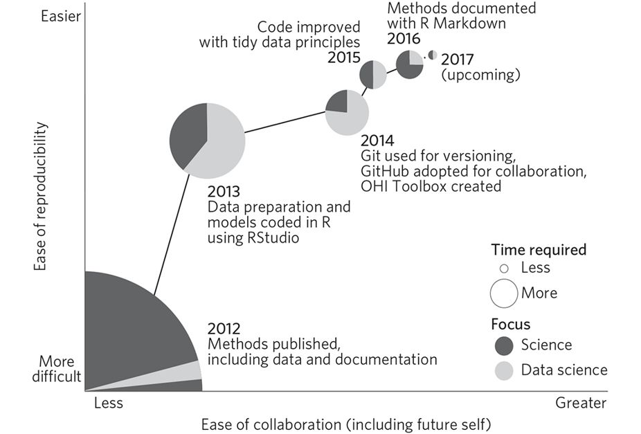

[materials]: session_01_materials.html
[slides]: slides/session_01_slides.html
[gapminder]: http://www.gapminder.org/data/

## Links

- [Materials]
- [Slides]

## Outline

1. Who am I? Who are you? What are we doing here?

<!-- https://www.thoughtco.com/icebreaker-understand-student-expectations-31374 -->

1. Show of hands...

    - <i class="em em-woman-raising-hand"></i> Installed **R**
    
    - <i class="em em-man-raising-hand"></i> Installed **RStudio**
    
    - <i class="em em-clap"></i> Installed **tidyverse**
    
1. RStudio walk through

1. Workspaces and projects

## Sources for this session

- http://swcarpentry.github.io/swc-releases/2016.06/r-novice-gapminder/
    - [Introduction to R and RStudio](http://swcarpentry.github.io/swc-releases/2016.06/r-novice-gapminder/01-rstudio-intro/)
    - [Project Management with RStudio](http://swcarpentry.github.io/swc-releases/2016.06/r-novice-gapminder/02-project-intro/)
    - [Seeking Help](http://swcarpentry.github.io/swc-releases/2016.06/r-novice-gapminder/03-seeking-help/)
- [stat545-ubc.github.io](https://stat545-ubc.github.io/)
    - [R basics, workspace and working directory, RStudio projects](http://stat545-ubc.github.io/block002_hello-r-workspace-wd-project.html)
    - [Basic care and feeding of data in R](http://stat545-ubc.github.io/block006_care-feeding-data.html)

## Why R?

- Nature: [Our path to better science in less time using open data science tools](https://www.nature.com/articles/s41559-017-0160)

    

- Hadley Wickham [Should all statistics students be programmers?](https://speakerdeck.com/hadley/should-all-statistics-students-be-programmers)

    - In particular, code is text slides and Excel: "fear of clicking the wrong thing"
    - Interesting code snippet for gif: https://twitter.com/ricardokriebel/status/849626401611411458
    - Includes small example from `tidycensus`


## RStudio Skills

- RStudio Panes
    - Run some R commands
    - Find your files
    - Environment
    - Source Pane
    - Viewer (`View()`)
    - History
    - Packages
    - Plots
- Tab Completion!


## Let's Process Some Data

This example builds on an excerpt of the [Gapminder] data, and contains the following columns.

```{r echo=FALSE}
tibble::tribble(
    ~variable, ~meaning,
    "country",       "Country",
    "continent",       "Continent",
    "year",       "Year",
    "life_expectancy",       "Life Expectancy at Birth",
    "population",       "Total Population",
    "gdp_per_capita",       "Per-Capita GDP"
) %>% 
  mutate(variable = paste0("`", variable, "`")) %>% 
  knitr::kable()
```


### Importing the data

Download the data from [materials].

```{r}
gapminder <- read_csv("materials/01/gapminder.csv")
```


### Viewing the data

```{r}
gapminder
```


### Using dplyr

```{r}
gapminder %>% 
  group_by(continent) %>% 
  count()
```

```{r}
gapminder %>% 
  group_by(year) %>% 
  count()
```

```{r}
gapminder %>% 
  filter(year == 2007)
```

```{r}
gapminder %>% 
  filter(year == 2007) %>% 
  group_by(continent) %>% 
  summarize(population = sum(population))
```

```{r}
gapminder %>% 
  filter(year == 2007) %>% 
  group_by(continent) %>% 
  summarize(mean_life_exp = mean(life_expectancy))
```
