[materials]: session_01_materials.html
[slides]: slides/session_01_slides.html
[gapminder]: http://www.gapminder.org/data/

```{r setup, include=FALSE}
knitr::opts_chunk$set(comment = "", prompt = TRUE)
set.seed(42)
```

## Links

- [Materials]
- [Slides]

## Introduction

See [slides] for the course introduction covering some background on R, why programming can be more effective than point-and-click GUI software, and our expectations for the course.

## Sources for this session

The material for this session is drawn from the following sources.
We'll walk through a version of these introductions together.
When we're done it may seem like we don't know much, but we can already do some [basic data processing](#lets-process-some-data)

- [Software Carpentry: R for Early Programmers](http://swcarpentry.github.io/swc-releases/2016.06/r-novice-gapminder/)
    - [Introduction to R and RStudio](http://swcarpentry.github.io/swc-releases/2016.06/r-novice-gapminder/01-rstudio-intro/)
    - [Project Management with RStudio](http://swcarpentry.github.io/swc-releases/2016.06/r-novice-gapminder/02-project-intro/)
    - [Seeking Help](http://swcarpentry.github.io/swc-releases/2016.06/r-novice-gapminder/03-seeking-help/)
- [STATS545 at UBC](https://stat545-ubc.github.io/)
    - [R basics, workspace and working directory, RStudio projects](http://stat545-ubc.github.io/block002_hello-r-workspace-wd-project.html)
    - [Basic care and feeding of data in R](http://stat545-ubc.github.io/block006_care-feeding-data.html)

<!--
## Introduction to RStudio and R

### Layout of RStudio

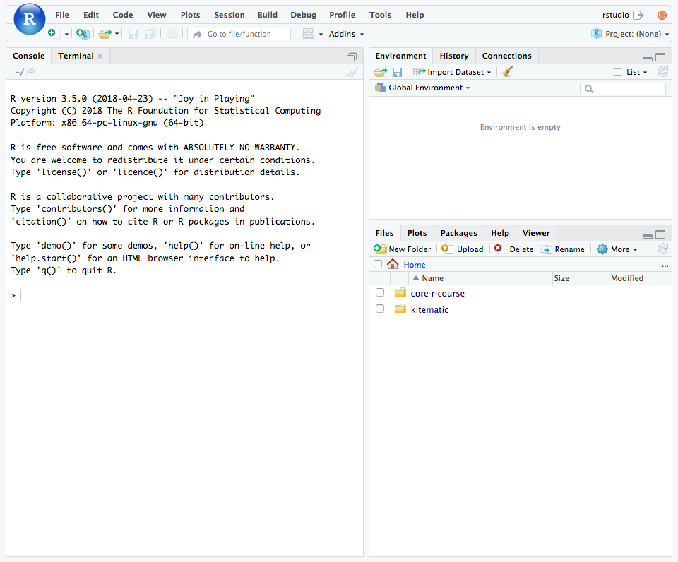
-->

## Getting to Know RStudio and R

In this session we started working with RStudio and started to learn the syntax of the R programming language.

### RStudio

When you open RStudio for the first time, it will look something like this.


### Console

On the left side of the RStudio window is the [Console]{.rstudio-tab} pane.
This pane contains a direct interface to your R session.
In other words, you can enter commands at the R prompt after the `>` and see the results right there.

#### Calculator

Try entering the following lines, hitting enter after each line.
These commands treat your R prompt like a calculator: you enter the expression you want to compute, hit enter and R gives you a value.
(Don't worry about entering the things after the `#`.)

```{r}
1 + 100
```

When you enter `1 + 100` at the prompt and press <kbd>Enter &crarr;</kbd>, R runs the expression, computes the value, and gives you the answer -- which is thankfully `101`.
Throughout these pages, I'll use the above styling to denote code that you should enter into the command prompt (colored text with grey background) and the output that you should see when you run the code yourself (black monospace text on a white background).

In this next example, suppose you press <kbd>Enter &crarr;</kbd> too early.
What happens?

R knows that the expression isn't complete, so it starts a new line for you, indicated by replacing the `>` with a `+`.
Remember this for later: usually you see this when you forget to close a pair of parenthesis `()` or brackets `{}`.

```{r}
1 +
1
```

```{r}
3 + 5 * 2

(3 + 5) * 2

(3 + (5 * (2 ^ 2))) # hard to read
3 + 5 * 2 ^ 2       # clear, if you remember the rules
3 + 5 * (2 ^ 2)     # if you forget some rules, this might help

2/10000 # scientific notation

5e3
```

#### Advanced Calculator (Functions)

R comes with a wide range of built-in functions that let you compute a wide range of stastically- and scientifically-relevant values.
Try the following commands.

```{r}
sin(1)
log(1)
rnorm(1)
```

These are functions: the function **name** is the part that comes first -- `sin` -- and the function **arguments** are entered inside the parenthesis.

As you start typing, you may have noticed that RStudio jumps in to help out.
Even within the console, RStudio helps make coding more convenient.

The first two functions do what their names suggest: `sin` calculates the value $sin(x)$ and `log` calculates the value $log_e(x)$.

The third function `rnorm()` is a little more complicated.
If we start typing `rnor`, we can see the help box that RStudio provides.
From here we learn that `rnorm()` does something related to the normal distribution and that it takes three arguments: `n`, `mean`, and `sd`.

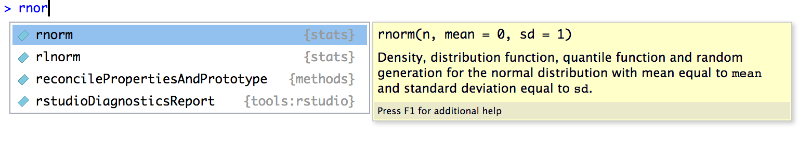

From this menu you can press <kbd>&#8593;</kbd> and <kbd>&#8595;</kbd> to browse through available functions.
When you stop on a function, R Studio will give you some information about the function, its overall purpose, and the expected arguments that the function accepts.

In this particular example, the help text only gets you part of the way, so I'll fill in meaning of `rnorm()` for you. 
This function is used to generate a _random number from the normal distribution_.

[Note that whenever you run `rnorm()` you'll get a randomly selected number, so the numbers you see below won't match your output on your computer exactly.]{.muted}

From this menu, pick `rnorm` and press <kbd>Tab</kbd> to complete the name, or you can type out `rnorm(`.
Then, within the function, press <kbd>Tab</kbd> again to bring up the RStudio helper menu.
This time, it shows you information about the arguments to the `rnorm()` function.

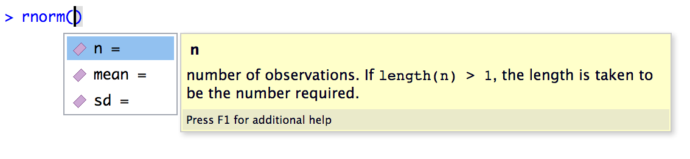

There are three ways to specify the value of a function argument in R:

1. **By position**. Enter the values for `n`, `mean`, and `sd` in the order they appear in the function.
   
   ```{r}
   rnorm(1, 10, 1)
   ```
   
2. **By name**. Use the name of the argument and the `=` sign to give values to the function.

   ```{r}
   rnorm(n = 1, mean = 10, sd = 1)
   ```
   
   As you can see, explicitly naming function arguments can be more clear to read than using positions, but it can also be somewhat "wordy".
   
3. **By default value**. If a value for a function is not specified, R will use the default value from the function's definition.

   ```{r}
   rnorm(n = 1, mean = 10)
   ```
   
   Here the default value for `sd` is `1`, so we didn't need to specify it.
   To be reminded of the default values of a function, we can hover over the function with the mouse and RStudio gives another tooltip.

   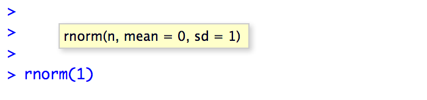
   
   Note that there is no default value for `n`, which means that you are _required_ to give a value for this one and you can't rely on the default value.
   
   ```{r error=TRUE}
   rnorm(mean = 1)
   ```

In practice, you'll find that typically the first one or two arguments to a function are clearly related to the meaning of the function and usually you don't need to give those arguments names.
Arguments that are later in the function definition can be considered "options" and it's often useful to explicitly mention the argument name.

```{r}
rnorm(1, mean = 100, sd = 25)
```

#### Comparing Things

In R, we can also compare two numbers or values to see if they're the same.

```{r}
1 == 1
1 != 2
1 < 2
4 <= 5
4 > 5
10 >= 1
```

This introduces a new data value type: the `logical` or `boolean` value.
In R, this is expressed as `TRUE` or `FALSE` -- always uppercase and (almost) always the full word.

It is possible to abbreviate `TRUE` as `T` and `FALSE` as `F`, but this isn't a good idea.
Why not?
R will never let you store a variable or function with the name `TRUE`, but it will let you store a variable with the name `T`.
To avoid confusion, just use the full name.

```{r}
FALSE == F
TRUE == T
```

### Environment

So far, everything we've entered into the console has given us output, but the results aren't saved.
In order to be useful, we need to be able to store values in variables and objects and use them again in later computations.

R is somewhat unique in it's use of the arrow `<-` as the assigment operator.
I read it as "is going to be", so 

```r
x <- 1/40
``` 

means `x` _is going to be_ `1/40`.

When assign a value to a variable at the console, R doesn't show you anything

```{r}
x <- 1/40
```

but if you enter the variable name, R will print out the value it stores.

```{r}
x
```

Now you can use that variable in functions and other expressions, even creating new variables with values computed using previous values.

```{r}
log(x)
y <- -log(x)
y
z <- round(y, 2)
z
```

Notice that the values `x`, `y`, and `z` are now stored in your _Environment_.
The environment is like the working memory of your R session.
RStudio tracks everything that's stored in your environment in the [Environment]{.rstudio-tab} pane in the upper right corner.

::: {.img-center}
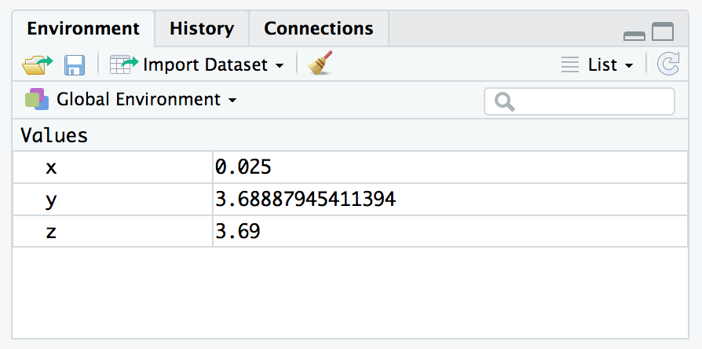{.img-mw500}
:::

#### Variable Names: What makes a name?

There are only three important rules about names:

- Can only contain numbers, letters, underscores, and periods
- Can't start with number
- Be descriptive!

Okay, so the last rule isn't a rule as much as a style guide.
Variable names are both for the computer and for the humans!
The computer doesn't care what the name is as long as you follow the rules, so you descriptive words that make it clear to _you_ what you meant with your code.

There are a few choices for how to write out the variable name you choose when it contains multiple words.

```r
name.with.dots <- 3
nameWithCamelHumps <- 2
name_with_underscores <- 1
```

The preference in the [tidyverse]{.pkg} (and my personal preference) is to use `names_in_snake_case` where words are separated by `_`.
In bioinformatics, it is also common to see `namesInCamelCase`, too.
Using dots is common but not recommended for technical reasons.

The final rule of naming things in R is that you can break all the rules if you wrap your name in backticks (<code>&grave;</code>).
You're allowed to use special characters and spaces if you write them like <code>&grave;Dollars Spent ($)&grave;</code>.

You'll likely see this when importing external data that were formatted in Excel or other software, but it's not as easy to type these specially-formatted names in your code, so you'll probably want to avoid them.

### History

As you run each command, RStudio keeps track of the commands you've run in the [History]{.rstudio-tab} pane.

::: {.img-center}
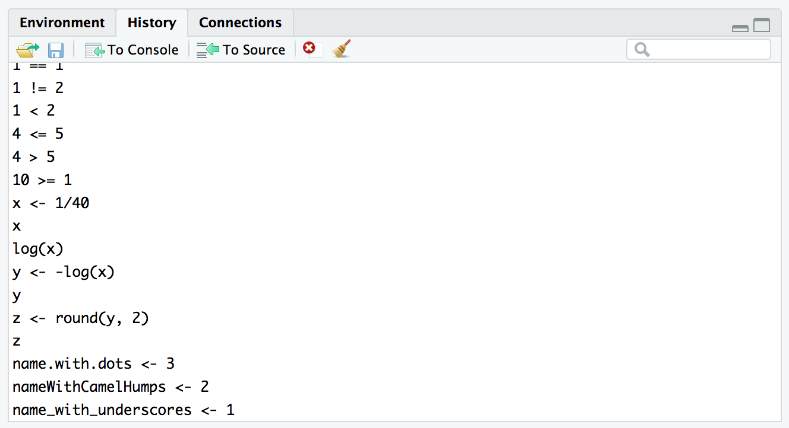{.img-mw500}
:::

You can also press <kbd>&#8593;</kbd> and <kbd>&#8595;</kbd> at the command prompt to walk through your previous commands.

### Scripts

Up to this point, the commands we've entered have ben _ephemeral_.
If we'd like to run a command again, or start from the beginning, we would need to search through our command history.

Writing your code inside **scripts** lets you track the procedures you're running.
During a data analysis you'll often need to try out different processing ideas to find the correct set of procedures that work.
Your goal is to keep a record of how to repeat your data processing from start to finish by storing each step in a script file.

To create a new script, select [File]{.menu-item} &rtrif; [New File]{.menu-item} &rtrif; [R Script]{.menu-item .selected} and an empty text file will open up.

R scripts are just plain text files, and they typically end with the `.R` or `.r` extension.

To use an R script, you simply enter your commands in the order they should be run in the text area.
There are several ways to run code from inside an R script:

1. Highlight the code you want to run, or put your cursor on the line you want to run, and press <kbd>Ctrl</kbd> + <kbd>Enter &crarr;</kbd> (Windows) or <kbd>&#8984;</kbd> + <kbd>Enter &crarr;</kbd> (Mac).
   
   You can also press the 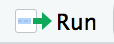 button at the top of the source file pane.

2. You can run the entire script using the 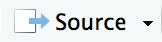 button as well.

   This is the same as running `source("filename.R")` in your console.

### Clearing your session

When you run your script, or the code inside your script, the commands build on top of previous code you've already run.

When you're working on a data processing task, you want to make sure that your code works from scratch.
Sometimes when you're working on code though, you'll try ouy a number of different ways of performing a task.
When you copy your code into your R script, it's easy to forget to include variables that you created or to leave out a step.

Clearing your R session and starting over completely is easy and highly recommended to make sure your scripts work as intended.
It's a two step process:

1. **Clear your workspace** by pressing the {.img-inline} button in the [Environment]{.rstudio-tab} pane, 
   or select [Session]{.menu-item} &rtrif; [Clear Workspace...]{.menu-item} from the RStudio menu bar.

2. **Restart your R session** by choosing [Session]{.menu-item} &rtrif; [Restart R]{.menu-item}.

At this point, you'll have an empty workspace and a fresh R session and you can run your script as new.

## Let's Process Some Data

In this and our next session, we'll be using an excerpt of the [Gapminder] data which contains the following columns.

```{r echo=FALSE}
tibble::tribble(
    ~variable, ~meaning,
    "country",       "Country",
    "continent",       "Continent",
    "year",       "Year",
    "life_expectancy",       "Life Expectancy at Birth",
    "population",       "Total Population",
    "gdp_per_capita",       "Per-Capita GDP"
) %>% 
  mutate(variable = paste0("`", variable, "`")) %>% 
  knitr::kable()
```

### Importing the data

Before we get started, make sure you're using a [clean R session](#clearing-your-session).

The first step is to copy the full url to the `gapminder.csv` file from the [materials] page.
We're going to use a function called `read_csv()` from the [readr]{.pkg} package.
This package is included in the [tidyverse]{.pkg} package and is automatically loaded when you run

```r
> library(tidyverse)
```


```r
gapminder <- read_csv("https://gerkelab.github.io/core-r-course/materials/01/gapminder.csv")
```

```{r echo=FALSE}
gapminder <- read_csv("materials/01/gapminder.csv")
```

`read_csv()` writes out a few messages to the console, letting us know how each column was parsed.

### Viewing the data

To view the data, simply call the variable `gapminder` to print out an overview.

```r
> gapminder
```

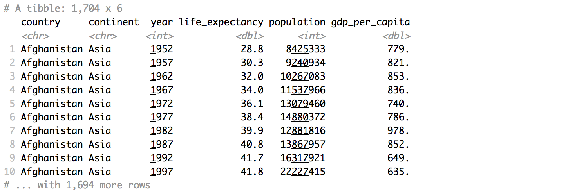

You can also click on the {.img-inline} button in the [Environment]{.rstudio-tab} pane next the the `gapminder` entry.

::: {.img-center}
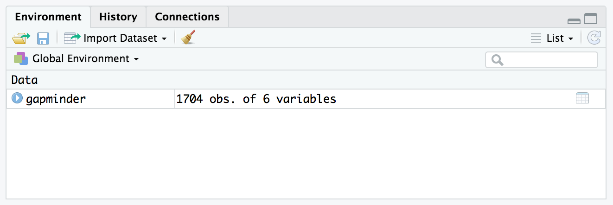{.img-mw500}
:::

This pulls up the RStudio data viewer where you can interactively explore the dataset.

::: {.img-center}
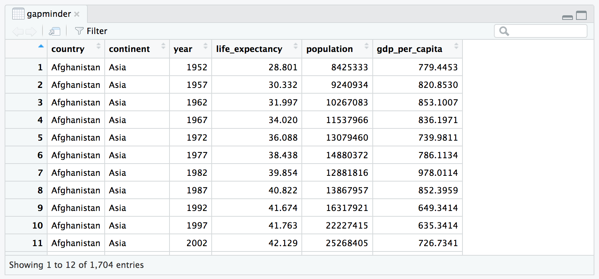{.img-mw500}
:::

### Using dplyr

Just to get a small taste of data processing in R, try running the following commands.

First, let's count the number of observations for each year in our dataset.
To do this, we are going to use [dplyr]{.pkg}, which provides a wide range of data processing functions (each named as a _verb_).

[dplyr]{.pkg} also gives us a new symbol called the "pipe" `%>%` that we will talk about more in our next session.
For now, just read this symbol as _and then_.

```{r}
gapminder %>% 
  group_by(year) %>% 
  count()
```

As another example, let's

1. Pick out the `continent` and `country` columns
2. Choose only the unique combinations of each
3. Count the number of countries in each `continent` by grouping by `continent` and counting the number of entries in each group.

In R code using the [dplyr]{.pkg} from the [tidyverse]{.pkg}, it looks like this:

```{r}
gapminder %>%
  select(continent, country) %>%
  distinct() %>%
  group_by(continent) %>%
  count()
```

### Exporting Data

To export the data, we can simply add another step

```r
gapminder %>%
  select(continent, country) %>%
  distinct() %>%
  group_by(continent) %>%
  count() %>% 
  write_csv("number_of_countries_in_each_continent.csv")
```
