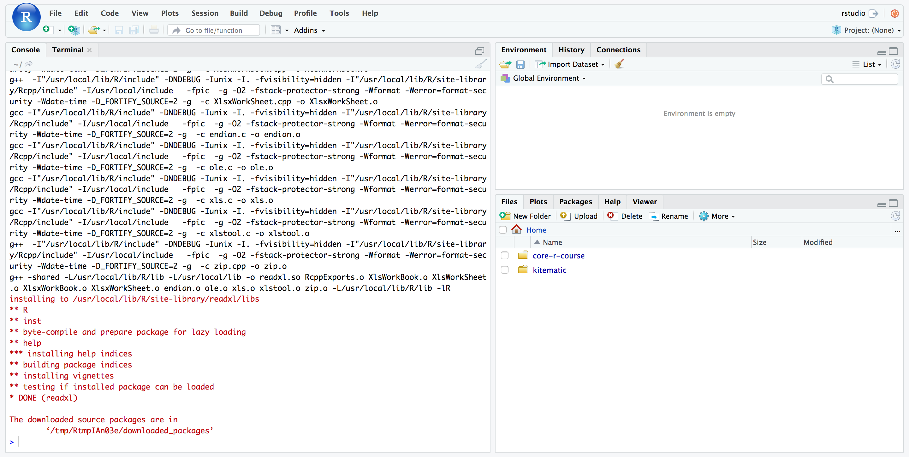
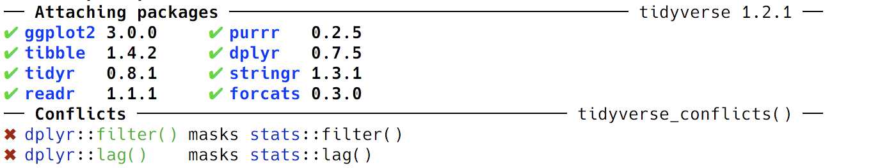
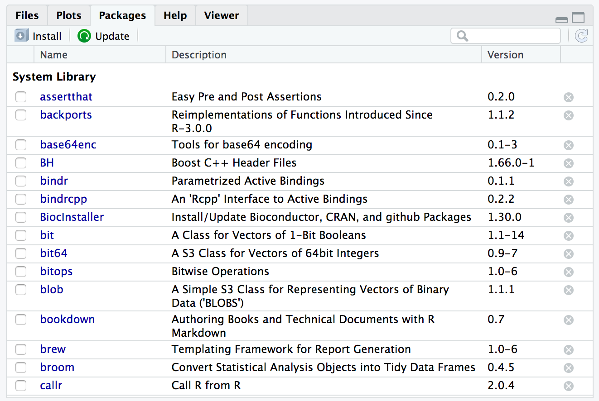
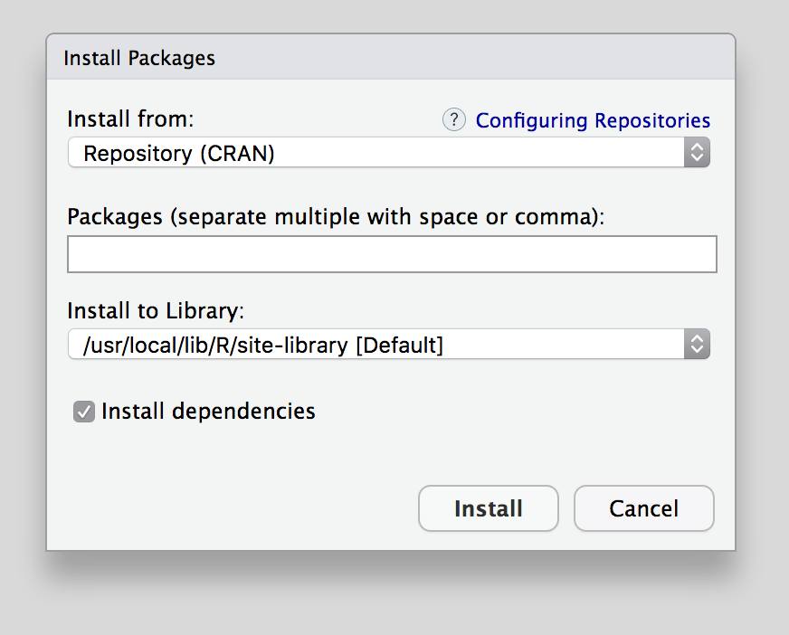
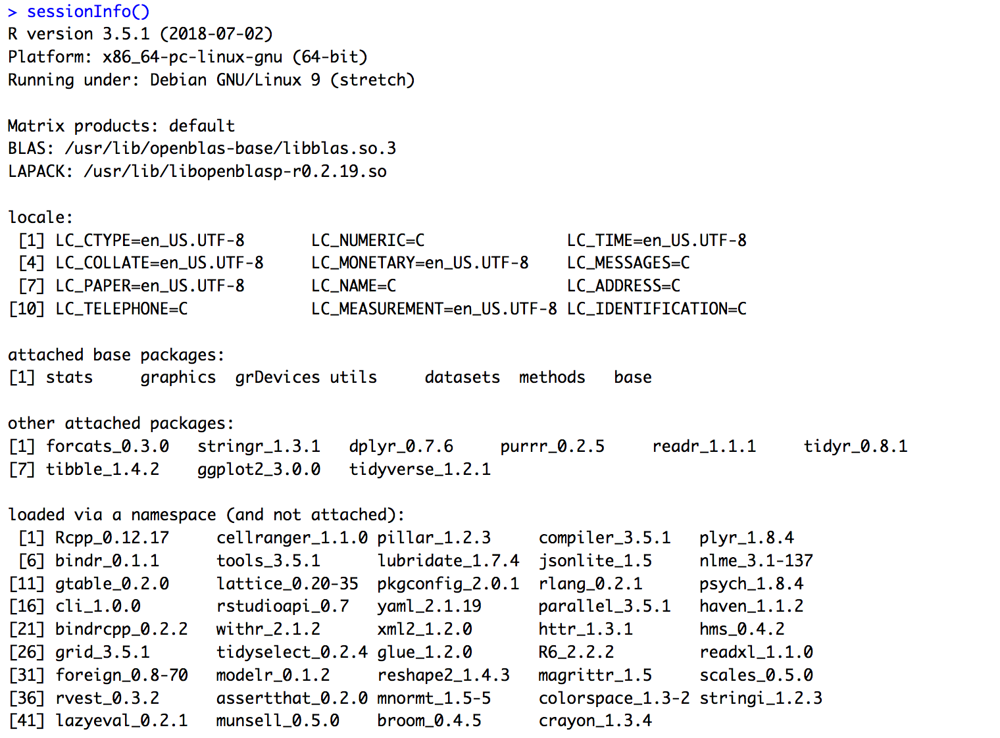
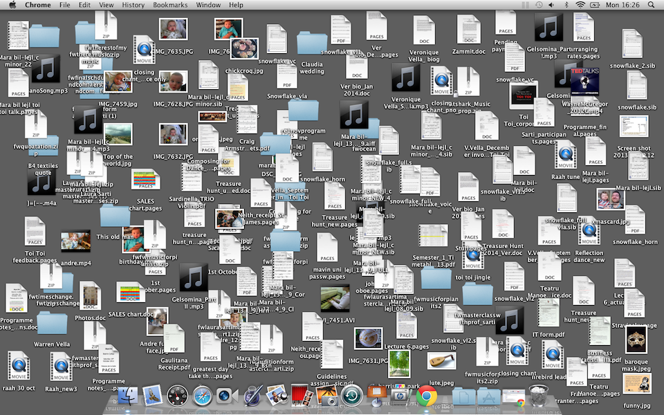
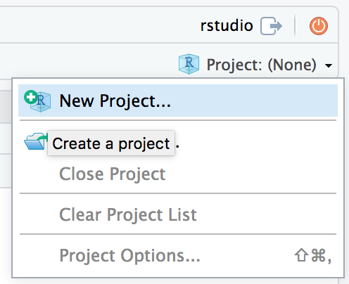
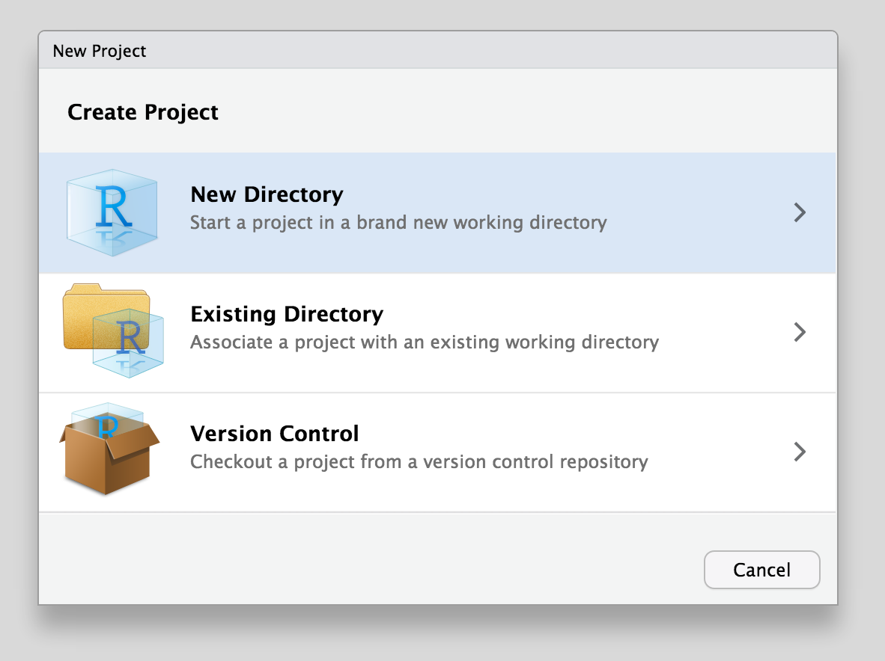
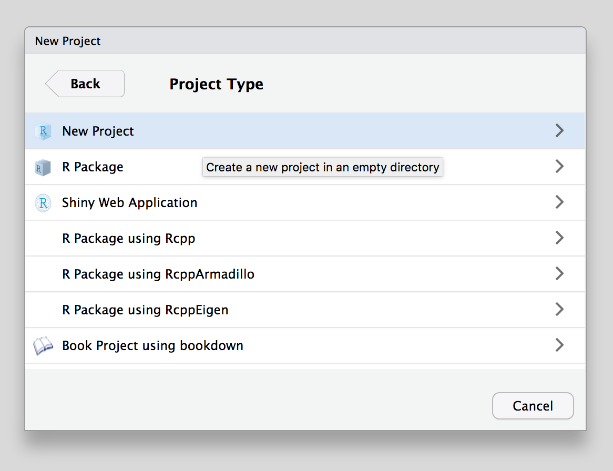
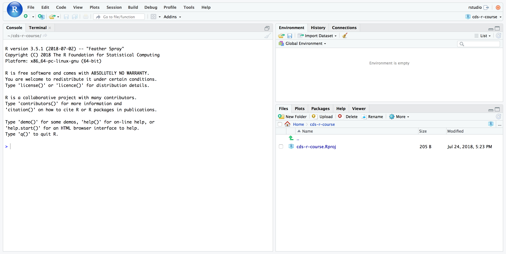

[materials]: session_01_materials.html
[slides]: slides/session_01_slides.html
[gapminder]: http://www.gapminder.org/data/
[cran]: https://cran.rstudio.com/
[metacran]: https://www.r-pkg.org
[cran-task-view]: https://cran.r-project.org/web/views/

```{r setup, include=FALSE}
knitr::opts_chunk$set(comment = "", prompt = FALSE, results = "show")
knitr::opts_hooks$set(echo_if_show_results = function(options) {
  if (options$echo_if_show_results) {
    options$echo <- options$results == "show"
  }
  options
})
set.seed(42)
```

## Links

- [Materials]

## Review

### Data Types

What kind of values are each of the following?

```r
10L
1.2345
"three"
```

### Functions and Arguments

What can you tell me about the value that will be returned when I run:

```{r review01, results='hide'}
runif(1, min = -1)
```

<details><summary>Result</summary>
```{r ref.label="review01", echo=FALSE, results="show"}
```
</details>

### Variable Names

Which of these are valid variable names?

```r
min_height
min.height
minHeight
MINHEIGHT
min-height
.min.height
_min_height
0height
min0height
`Minimum Height`
```

<details><summary>Results</summary>

These are all fine:

```r
min_height <- 14
min.height <- 14
minHeight <- 14
MINHEIGHT <- 14

min0height <- 14
`Minimum Height` <- 14
```

This one works, but creates a hidden variable.

```r
.min.height <- 14
```

These don't work and will cause an error.

```r
# Can't start with an `_`
_min_height <- 14

# This is subtraction
min-height <- 14

# Can't start with a number
0height <- 14
```
</details>

### Variables & Environment

What is the value of each variable after each of the following statements?

```{r review03, results="hide"}
todays_temp <- 31.6666
offset <- 32L
coef <- 1.8
intermed_temp <- todays_temp * coef
todays_temp <- intermed_temp + offset
round(todays_temp, 2)
```

<details><summary>Result</summary>
```{r ref.label="review03", echo=FALSE, results="show"}
```
</details>

### Getting Help

What do the following functions do?
Use `?`, `??` or the [Help]{.rstudio-tab} pane to learn about each function.
Come up with 1-3 examples of each function in action.

```r
identical(___)

tolower(___)

rep(___)

seq(___)
```

<details><summary>`identical`</summary>

> The safe and reliable way to test two objects for being exactly equal. It returns TRUE in this case, FALSE in every other case.

```{r review-identical, results="show"}
identical(1, 1L)

identical(-0, +0, num.eq = FALSE)

identical(1, NULL)
```
</details>

<details><summary>`tolower`</summary>

> Translate characters in character vectors, in particular from upper to lower case or vice versa.

```{r review-tolower, results="show"}
tolower("APPLE")

tolower("Help")

toupper("banana")
```
</details>

<details><summary>`rep`</summary>

> `rep()` replicates the values in `x`.

```{r review-rep, results="show"}
rep(1:4, 2)
rep(1:4, each = 2)       # not the same.
rep(1:4, c(2,2,2,2))     # same as second.
rep(1:4, c(2,1,2,1))
rep(1:4, each = 2, len = 4)    # first 4 only.
rep(1:4, each = 2, len = 10)   # 8 integers plus two recycled 1's.
rep(1:4, each = 2, times = 3)  # length 24, 3 complete replications
```
</details>

<details><summary>`seq`</summary>

> Generate regular sequences. seq is a standard generic with a default method. seq.int is a primitive which can be much faster but has a few restrictions. seq_along and seq_len are very fast primitives for two common cases.

```{r review-seq, results="show"}
seq(1, 9)
seq(0, 1, by = 0.1)
seq(0, 1, length.out = 11)
seq(1, 9, by = 2)     # matches 'end'
seq(1, 9, by = pi)    # stays below 'end'
seq(1, 6, by = 3)
seq(1.575, 5.125, by = 0.05)
seq(17) # same as 1:17, or even better seq_len(17)
```
</details>

### Highlighting New Concepts

These examples gave us a chance to review the things that we talked about during the last session, and they also introduced us to several new concepts that we will cover today.

1. Vectors

1. What are the `...`? (_further arguments passed to or from other methods_)

1. `NULL` and `NA`

## Overview

1. Packages

1. Collections: vectors, lists, data frames

1. Data types
    - Special data types: `NA`, `NULL`
    - Working with data types: `is`, `as`, `class`

1. Workspaces & RStudio Projects

1. Functions

1. dplyr

## Packages

### Installing Packages

```r
install.packages("tidyverse")
install.packages("readxl")
```



Most packages are hosted on [CRAN] [(cran.rstudio.com)]{.muted}.

How do you find packages?
Besides Google, you can use [MetaCRAN] [(r-pkg.org)]{.muted} to search for available packages.
Or you can use the [CRAN Task View][cran-task-view].

### Attaching (Loading) Packages

```r
library(tidyverse)
```



```{r echo=FALSE}
tidyverse_pkgs <- 
tidyverse_packages(include_self = FALSE) %>% 
  str_replace("\n.+", "") %>% 
  paste0("`", ., "`") %>% 
  knitr::combine_words()
```

Includes the following packages: `r tidyverse_pkgs`.

```r
library(readr)
library(dplyr)
library(stringr, tibble) #<< Doesn't do what you think
```

::: {.img-center}
<blockquote class="twitter-tweet" data-conversation="none" data-lang="en"><p lang="en" dir="ltr"><a href="https://twitter.com/ijlyttle?ref_src=twsrc%5Etfw">@ijlyttle</a> a package is a like a book, a library is like a library; you use library() to check a package out of the library <a href="https://twitter.com/hashtag/rsats?src=hash&amp;ref_src=twsrc%5Etfw">#rsats</a></p>&mdash; Hadley Wickham (@hadleywickham) <a href="https://twitter.com/hadleywickham/status/541948905009586176?ref_src=twsrc%5Etfw">December 8, 2014</a></blockquote>
<script async src="https://platform.twitter.com/widgets.js" charset="utf-8"></script>
:::


### Using RStudio

You can also use the [Packages]{.rstudio-tab} pane to install and update, 

::: {.img-center}
{.img-mw500}
:::

or [Tools]{.menu-item} &rtrif; [Install Packages...]{.menu-item}.

::: {.img-center}
{.img-mw500}
:::

### Behind the Scenes

A package contains:

1. Functions
1. Documentation
1. *Vignettes*
1. *Data*

```r
library(babynames)

install.packages("babynames")
```

```{r error=TRUE}
babynames

babynames::babynames

library(babynames)
babynames
births

ls("package:babynames")

detach("package:babynames", unload = TRUE)
```



## Collections

### Vectors

```{r}
1:3

c(1, 2, 3)

identical(1:3, c(1, 2, 3))

identical(1:3, c(1L, 2L, 3L))

c(1L, 2L, 3L, pi)

fruits <- c("apple", "banana")
fruits

fruits <- c(fruits, "cherimoya")
```

](images/cherimoya.jpg)

```{r echo_if_show_results=TRUE}
fruits
```

```{r}
month_days <- c("March" = 31, "April" = 30, May = 31)

month_days

names(month_days) <- c("August", "September", "October")
month_days

month_days["October"]
```

### Lists

```{r}
x <- list(
  fruits = fruits,
  months = names(month_days),
  month_days = month_days
)

x
```

### Data Frames and Tibbles

```{r}
y <- data.frame(
  fruits = fruits,
  months = names(month_days),
  month_days = month_days
)
y

y2 <- data.frame(
  fruits = fruits,
  months = names(month_days),
  month_days = month_days,
  stringsAsFactors = FALSE,
  row.names = NULL
)
y2

z <- data_frame(             #<< tibble()
  fruits = fruits,
  months = names(month_days),
  mont_days = month_days
)
z
```

## Data Types

### Review

| Type | Example |
|:----:|:--------|
| integer | `1L` |
| double | `3.14`, `1.23e-4` |
| character | `"apple"` |
| logical | `TRUE`, `FALSE` |
| vector | `c(...)` |
| list | `list(...)` |
| data.frame | `data.frame(...)` |
| tibble | `data_frame(...)` |
| N/A | `NA` |
| null | `NULL` |
| factor | `factor(letters)` |

### Special Data Types

```{r}
c(1, 2, NA, 4)

c(1, 2, NULL, 4)
```

### Factors

We'll talk about this later, but it's basically a vector with an additional **label** and sometimes an **order**.

<details><summary>Sneak Peek</summary>

```{r factor-sneak-peek, results="show"}
factor(1:3)
factor(1:3, 
       levels = 1:3)
factor(1:3, 
       levels = 1:3, 
       labels = c("a", "b", "c"))
factor(1:3, 
       levels = 1:3, 
       labels = c("a", "b", "c"), 
       ordered = TRUE)
factor(1:3, 
       levels = 3:1, 
       labels = c("a", "b", "c"), 
       ordered = TRUE)
```
</details>


### Working with Data Types

#### What is this thing?

```{r}
x <- 1L
y <- pi
z <- "apple"

class(x)
class(y)
class(z)
typeof(z)

class(mtcars)
```


#### Are you this thing?

```{r}
is.integer(1L)
is.numeric(pi)
is.numeric(1L)
is.double(1L)
is.character("one")
is.logical("TRUE")
```

#### Are you even there?

```{r}
is.na(c(1, 2, NA, 4))

is.null(c(1, 2, NULL, 4))

xyz <- NULL
is.null(xyz)
```

#### Turn you into this thing.

```{r}
as.character(1)
as.integer(pi)
as.double(10L)
as.logical(2)
```


## Workspaces & RStudio Projects

### Working Directory

The working directory is where R looks when it tries to find a file or where it writes a file.

You can check where your R process is "living" -- i.e. your working directory -- with

```r
getwd()
```

and you can set it with 

```r
setwd("~/myCoolProject")
```

But **this is not recommended**!

You can also use [More]{.menu-item} &rtrif; [Set As Working Directory]{.menu-item} or [Go To Working Directory]{.menu-item} in the [Files]{.rstudio-tab} pane to set the working directory, but this is **also not recommended**.

[When should you? When you get lost.]{.muted}

### Using RStudio Projects

Without some kind of organization scheme, you'll very quickly end up writing all of your R scripts in a single folder.
Multiple analysis will write out files, exporting data and creating plots, each of these writing into the same folder.



Instead, RStudio offers an excellent method of organization called **Projects**.
Using RStudio projects, each analysis is self-contained and organized, each in its own way, and it's easy to switch from one project to another and know that your files will be organized, your environment will be clean, and you can pick everything back up from where you started.

](images/obsessively-organized.jpg)

### Create an RStudio Project

Select [File]{.menu-item} &rtrif; [New Project]{.menu-item} or choose [New Project]{.menu-item} from the drop-down menu in the upper right corner of the RStudio window.

::: {.img-center}
{.img-mw500}
:::

Select **New Directory** to create your project in a new directory.
If you already have files in a directory that you want to use, choose _Existing Directory_.

::: {.img-center}
{.img-mw500}
:::

Select the type of project you want to start -- this will generally be **New Project**.

::: {.img-center}
{.img-mw500}
:::

Choose the name for the folder that will be created to house your project and pick the folder where the project folder will be created.

Here we give the new project folder the name **`cds-r-course`**.
This will also be the name of the project itself.

::: {.img-center}
{.img-mw500}
:::

Your project will be created and you'll be dropped into a new R/RStudio session.



### Work with your project

Use the [Files]{.rstudio-tab} to create a folder called `data` in your project folder.

Run the following command to download the `gapminder.csv` file into your `data` folder.

```r
> download.file("https://gerkelab.github.io/core-r-course/materials/01/gapminder.csv", "data/gapminder.csv")
```

Create a new R script.
Add the following code to it.

```{r eval=c(-1)}
library(tidyverse)

patient_id <- 5554321
age_at_diagnosis <- 54
age_at_visit <- 54:58
tumor_size <- c(9.5, 9.5, 9.7, 9.9, 10.1)
site_code <- c("C220", "C220", "C412", "C400", "C400")
```

Save the file as `example_single_patient.R`.

Source the file. 

Close the project. 
Take a deep breath.
Re-open the project.

## Functions

### Functions that work with vectors

So far we've primarily seen vectors that operate on single values or that take single-valued arguments.

But as we've seen, R is a _vectorized language_.

Try using the following functions on the variables we created in `example_single_patient.R`.

```{r}
min(tumor_size)
max(tumor_size)
mean(tumor_size)
median(tumor_size)
var(tumor_size)
sd(tumor_size)
IQR(tumor_size)
```

Those functions all come from base R (standard R library).

The following functions are given to us from `dplyr`.
We have dplyr loaded if we've run `library(tidyverse)`, but I'll include the `dplyr::` first as a reminder that that's where these functions come from.

```{r}
dplyr::first(site_code)
dplyr::last(age_at_visit)
dplyr::nth(site_code, 2)
dplyr::n_distinct(site_code)
```

All of these functions return a single value.
Try the following.
What happens and why?

```{r}
tumor_size * 10

age_at_visit - age_at_diagnosis

paste("Site Code:", site_code)
```

Because R is vectorized, operations are applied to the whole vector.

### Dot, dot, dot

R has a somewhat unique addition for writing and using functions: the dot-dot-dot (`...`).

The `...` is used in two ways:

1. To allow you to include an unknown number of values.

   ```{r results='asis', echo=FALSE}
   cat("\n   ```", paste("paste <-", capture.output(print(paste))[1]), "```", sep = "\n   ")
   ```

   ```{r}
   paste("a", "b", "c")
   paste("a", "b", "c", "d")
   ```
   
2. To allow you to pass arguments to an underlying function.

   ```{r results='asis', echo=FALSE}
   cat("\n   ```", paste("rep <-", capture.output(print(rep))[1]), "```", sep = "\n   ")
   ```

   ```{r}
   rep(1L, 4)
   rep(1L, times = 4)
   rep.int(1L, times = 4)
   ```
   
