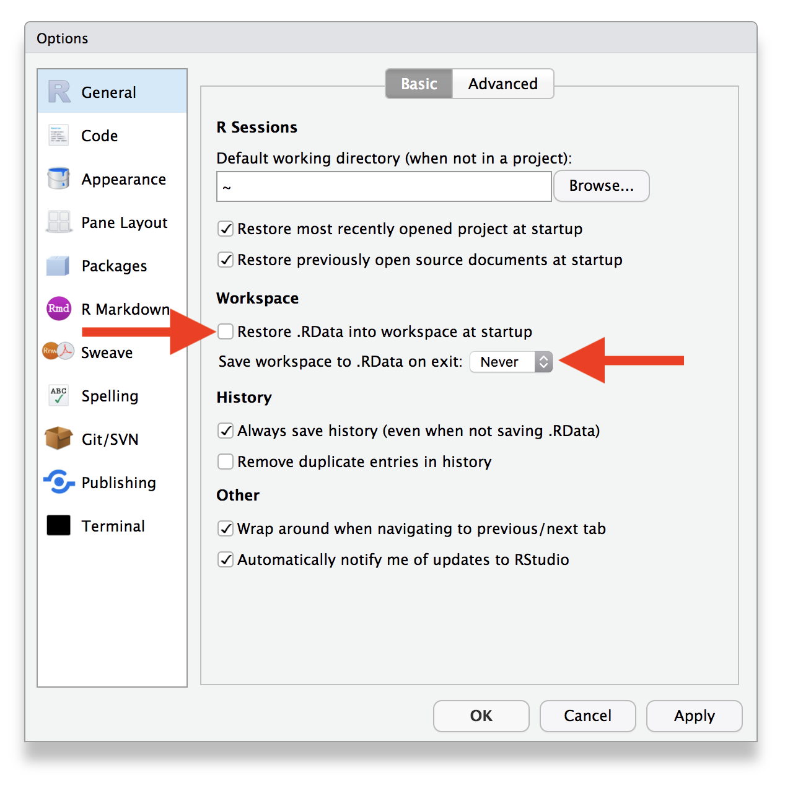

```{r session-08-init, include=FALSE}
session_links <- list(
  "R for Data Science: Strings" = "http://r4ds.had.co.nz/strings.html",
  "STAT545: Character Data" = "http://stat545.com/block028_character-data.html"
)
```

## Review

### Working with Strings

**Question:** You have a vector that contains two strings.

```{r}
library(stringr)
txt <- c("pfx-003-sfx", "pfx-987-sfx")
```

Match the function that was used to the output that it created.

```{r echo=FALSE, results = "asis"}
fns <- c(
  'str_detect(txt, "003")',
  'str_extract(txt, "\\\\d+")',
  'str_remove(txt, "-sfx")',
  'str_c(txt, collapse = " and ")',
  'str_replace(txt, "pfx", "prefix")'
)

answers <- letters[sample(seq_along(fns), length(fns))]
names(answers) <- fns

results <- purrr::map_chr(names(sort(answers)), ~ capture.output(dput(eval(parse(text = .)))))

cat(glue::glue("\n1. `{names(answers)}`"), sep = "\n")
cat("\n")
cat(glue::glue("\n{sort(answers)}. `{results}`"), sep = "\n")
```

<details><summary>Answers</summary>

```{r echo=FALSE, results="asis"}
cat(glue::glue("{.i}. {answers}", .i = seq_along(answers)), sep = "; ")
```
</details>

**Question:** The following ICD10 codes describe a selection of ICD codes for "Malignant melanomas of the skin".

```{r results='asis', echo=FALSE}
icd.data::icd10cm2016 %>%
  as_tibble() %>%
  filter(str_detect(chapter, regex("neoplasm", TRUE)), str_detect(code, "C43")) %>%
  slice(1:10) %>%
  select(code, Description = short_desc) %>% 
  mutate(code = glue::glue('<span style="color: #CD4F39; font-family: Fira Mono, monospace;">{code}</span>')) %>% 
  rename(`ICD Code` = code) %>% 
  knitr::kable(escape = FALSE)
```

1. Describe in words all of the patterns you can find in the ICD code and its description.

1. How can you extract the specific location referred to in the description text?

1. How could you find all patients with melonoma located on the eyelid? On the ear?

1. Write a regular expression that finds ICD codes indicate melanoma on the _right side_ of the body.

## Outline

- Homework and Sharing

- Base R: The other side of R
    - Subsetting
    - Factors (forcats)
    
- Project Management

- Looking Forward
    - Workshop format
    - Topics we can talk about

## Show and Tell


<details><summary>Who's ready?</summary>


</details>

<details><summary>You're Awesome!</summary>


</details>

## Base R: The Other R

### Another way to do things

**R** is about `r lubridate::year(Sys.Date()) - 1993` years old, or
`r lubridate::year(Sys.Date()) - 1976` if you count its "first version" **S**.

[dplyr]{.pkg}, on the other hand, started in October of 2012 but the version most consistent with the things that we've learned wasn't released until **October 2014** -- or 
`r round(difftime(Sys.time(), lubridate::ymd_h("2014-10-06 0"), "days")/365.25, 1)` years ago.

This means that when you run into issues and search around online in places like [StackOverflow](https://stackoverflow.com/questions/tagged/r), you'll often run into R code written in _base R_.
It's also useful to know a bit about base R functions when you need to do more programming-style work, as opposed to the data analysis workflows we've been learning.

This section is intended to give a very quick overview of several parts of base R that we haven't talked about much, primarily to help you translate code you find online into [dplyr]{.pkg}-based code that you're used to.

We'll use the `example` data frame from [Session 3](session_03_answers.html#workspaces__rstudio_projects) for this section.

```{r echo=FALSE, results="show"}
source(here::here("materials/03/example_single_patient.R"))
x <- example
```

```{r echo=TRUE, prompt = TRUE, comment = ""}
x
```

### Selecting Elements of a Vector

First, let's say that you have a vector.

```{r}
v <- c(10, 14, 6)
```

You can get a particular element of the vector using `[ ]`.

```{r}
v[2]
```

[Sidenote: does R start counting elements from 0 or from 1?]{.muted}

You can extract more than one element by using a vector.

```{r}
v[c(1, 3)]
```

You can discard elements with negative indices.

```{r}
v[-2]
```

And you can use `TRUE` and `FALSE` to discard elements that are in the same position as the `FALSE`.

```{r}
v != 14
v[v != 14]
v[c(TRUE, FALSE, TRUE)]
```

Suppose this vector is actually a count of the number of fruit that we have.
If the vector has names, we can use the names to select specific elements.

```{r}
names(v) <- c("kiwi", "lime", "mango")
v["mango"]
v[c("kiwi", "lime")]
```

Suppose instead of a vector, we have a list.

```{r}
l <- list(
  orange = 25,
  plum = 13,
  quince = 30
)
```

<details><summary>Yes, it's a real fruit</summary>


</details>

Lists are slightly more tricky.
Using one set of `[ ]` gives you back another list with the elements in the brackets, or you can get a specific element with double brackets `[[ ]]`.

```{r}
l["orange"]
l[c("orange", "plum")]
l[["quince"]]
```

The double brackets can only give you **one** entry; you'll get an error if you try to get more than one.

```{r error=TRUE}
l[[c("orange", "plum")]]
```

Did you notice the `$` in the output?
That's because the dollar sign is _yet another subsetting operator_ and it works exactly the same as `[[ ]]`.

```{r}
l$plum
l[["plum"]]
```

Why are there ~~two~~ three ways to subset lists?
First: why does there need to be a difference between `[ ]` and `[[ ]]`?

```{r}
l$other <- c("rambutan", "starfruit", "tomato")
l
```

<details><summary>Yup, it really is, too...</summary>


</details>

```{r}
l[c("orange", "other")]
l[["orange"]]
l[["other"]]
c(l$other, l$orange)
```

### Subsetting Columns and Rows

The syntax for data frames (or tibbles) is very similar.
The only difference is that the single brackets `[ ]` take two arguments -- _rows_ and _columns_ -- and the double brackets `[[ ]]` (or `$`) return _columns_.

```{r}
x
x[1, 2]
x[c(1, 4), c(2, 3)]
x[1:2, c("age_dx", "age_visit")]

x$patient_id
x[["age_dx"]]
```

What if you just want to select certain rows or certain columns?

```{r}
x[c(1, 4), ]
x[, 1:2]
```

What does this code do?

```{r}
x[x$age_visit > x$age_dx, ]$tumor_size
```

#### In [dplyr]{.pkg}-speak

```r
# Base R
x[, c("age_dx", "age_visit")]
```

```{r}
x %>% select(age_dx, age_visit)
```

```r
# Base R
x[c(1, 4), ]
```

```{r}
x %>% slice(c(1, 4))
```

```r
# Base R
x[1, 2]
```

```{r}
x %>% 
  slice(1) %>% 
  select(2)
```


```r
# Base R
x[x$age_visit > x$age_dx, "tumor_size"]
```

```{r}
x %>% 
  filter(age_visit > age_dx) %>% 
  select(tumor_size)
```

```r
# Base R
x[x$age_visit > x$age_dx, ]$tumor_size
```

```{r}
x %>% 
  filter(age_visit > age_dx) %>% 
  pull(tumor_size)
```


### WTF: What the Factor?

Imagine you have a variable that records months:

```{r}
m <- c("Dec", "Oct", "Sep", "May")
```

Using a string for this variable has two problems:

1. There are only 12 possible values. What if you make a mistake?

   ```{r}
   m2 <- c("Dev", "Oct", "Seo", "May")
   ```

1. You can't sort in a useful way.

   ```{r}
   sort(m)
   ```
   
A **factor** solves both of these problems:

1. It adds the concept of a categorical *level*

   ```{r}
   month_levels <- c(
     "Jan", "Feb", "Mar", "Apr", "May", "Jun", 
     "Jul", "Aug", "Sep", "Oct", "Nov", "Dec"
   )
   m <- factor(m, levels = month_levels)
   m
   ```

1. that have an explicit order

   ```{r}
   sort(m)
   ```

If you try to create a factor with a typo, you'll get a missing value

```{r}
factor(m2, levels = month_levels)
```

#### Package Spotlings: [forcats]{.pkg}

If you end up needing to work with factors, try [[forcats]{.pkg}][forcats].

[forcats]: https://forcats.tidyverse.org

[][forcats]

> R uses factors to handle categorical variables, variables that have a fixed and known set of possible values. 
Historically, factors were much easier to work with than character vectors, so many base R functions automatically convert character vectors to factors.
> 
> These days, making factors automatically is no longer so helpful, so packages in the tidyverse never create them automatically.
However, factors are still useful when you have true categorical data, and when you want to override the ordering of character vectors to improve display. 
The goal of [the forcats package][forcats] is to provide a suite of useful tools that solve common problems with factors.

To load [[forcats]{.pkg}][forcats]:

```r
library(tidyverse)

# or
library(forcats)
```


## Project Management Tips

1. Start a new project, start a new **RStudio** project.

1. Save "clean" code: have one file that runs your analysis

    - Write scratch code in console or a script

    - Save working code into a _good_ script

    - Restart R and run from the beginning after you lock-in each step

1. When you're comfortable, turn off saving `.RData` in RStudio Settings

   {.img-mw500}


## Looking Forward

### Bi-Weekly Workshops

Every other week, starting the week of September 17, 2018.
What time works for you?

<http://whenisgood.net/gerkelab/cds-r-follow-up>


#### Goals

1. Collaborative workspace for problem solving

1. Learn more programming and data processing techniques


### Potential Topics

1. Creating data-driven reports with [R Markdown](https://rmarkdown.rstudio.com/).

1. Visualizing data with [ggplot2](https://ggplot2.tidyverse.org/)

1. Writing functions for repeatable analysis

1. Using version control software to track changes

1. Accessing data stored in databases with [dbplyr](https://dbplyr.tidyverse.org/)


### Stay in Touch!


