```{r setup, include=FALSE}
options(htmltools.dir.version = FALSE)
```

class: inverse center middle

# Who are we?

???

- Name, what do you do here?,  cat/dog/none, first computer

---
class: center middle


## Garrick Aden-Buie

### Cancer Epidemiology<br>Dr. Travis Gerke

#### Garrick.Aden-Buie@moffitt.org

&commat;grrrck<br>
garrickadenbuie.com

---
class: inverse center middle

# What's so cool about R?

---
background-image: url("../images/r-logo.svg")
background-position: 90% 60%
background-size: 350px

## What is R?

> R is a free software environment for statistical computing and graphics.

- Both interactive environment and programming language

- Designed by Statisticians

- Quirky

- <http://r-project.org>

???

Ross and Robert

---
background-image: url("../images/tidyverse-hex-logo.png")
background-position: 90% 80%
background-size: 300px

## tidyverse

> The tidyverse is an opinionated collection of R packages designed for data science.

- Consistent data structure and grammar

- A common design philosophy

- Everything fits together nicely

- <https://tidyverse.org>

---

## Falling into the Pit of Despair

.center[
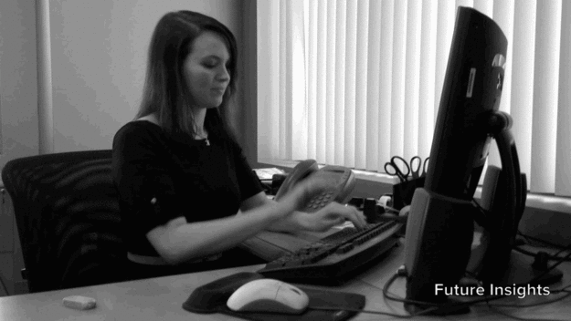
]

---

## Falling into the Pit of ~~Despair~~ Success

.center[

]

---

## Two options for data processing

.pull-left.center[
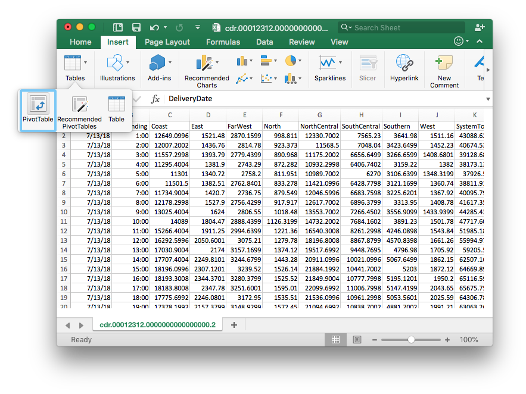
**GUI**
]

.pull-right.center[
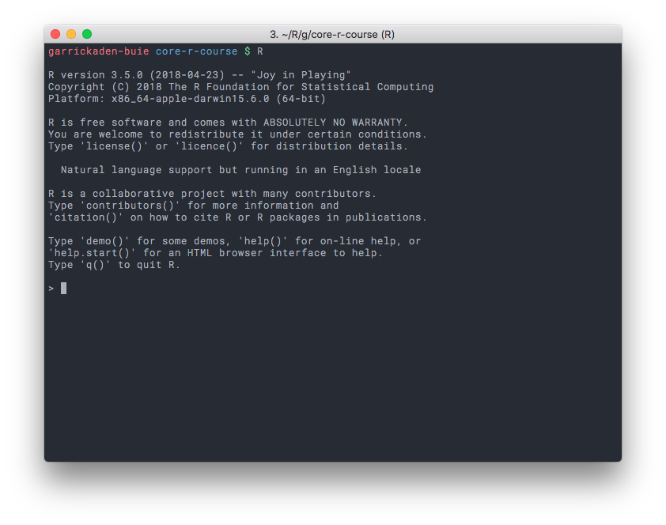
**Command Line**
]

---

## Two options for data processing

.pull-left.center[
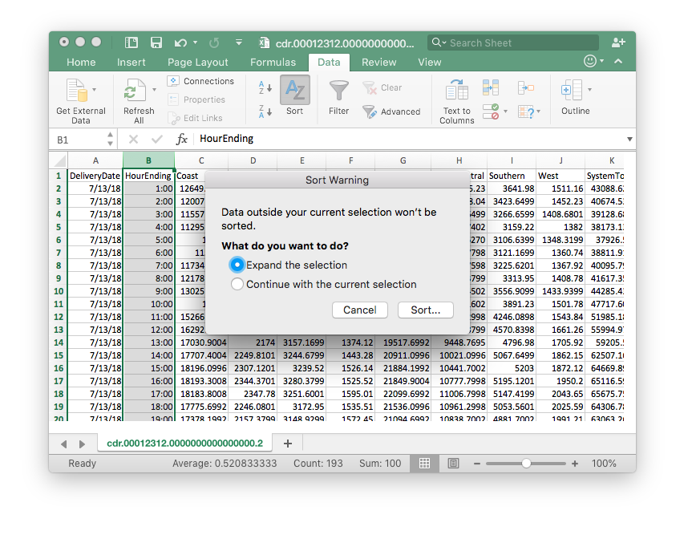
.big[&#x1F914;]
]

.pull-right.center[

**Command Line**
]

---
layout: true
## Why learn how to program?
---

.footer[https://speakerdeck.com/hadley/should-all-statistics-students-be-programmers]

.third.left-column[
### Code is text
]
--
.two-third.right-column[
.large[<kbd>Ctrl</kbd>+<kbd>C</kbd> & <kbd>Ctrl</kbd>+<kbd>V</kbd>]
]

---

.third.left-column[
### Code is text
### Code is read-able
]
.two-third.right-column[
```r
bookings %>% 
  mutate(
    total_price = price_per_night * room_nights
  ) %>% 
  summarise(
    n          = n(),
    n_stayed   = sum(status == "stayed"),
    mean_price = mean(total_price)
  )
```
]

---

.third.left-column[
### Code is text
### Code is read-able
### Code is shareable
]
.two-third.right-column.center[
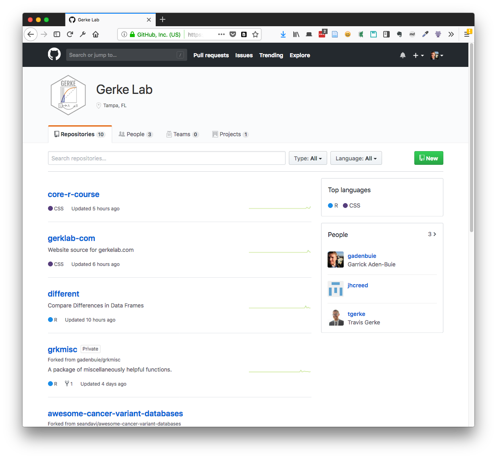
]

---

.third.left-column[
### Code is text
### Code is read-able
### Code is shareable
]
.two-third.right-column.center[
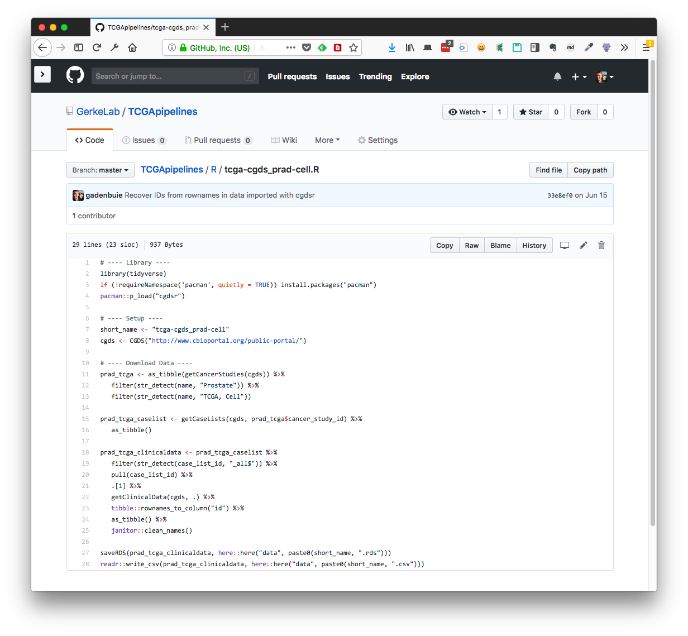
]


---

.third.left-column[
### Code is text
### Code is read-able
### Code is shareable
### Code is open
]
.two-third.right-column.center[

]

.footer[<https://blog.mitchelloharawild.com/blog/user-2018-feature-wall/>]

---
layout: false
class: inverse center middle

# Joining the R Community

---

# Goals for this course

.large[
1. Hands-on, applicable

2. Empowering

3. Collaborative
]

---
## Learning

.center[
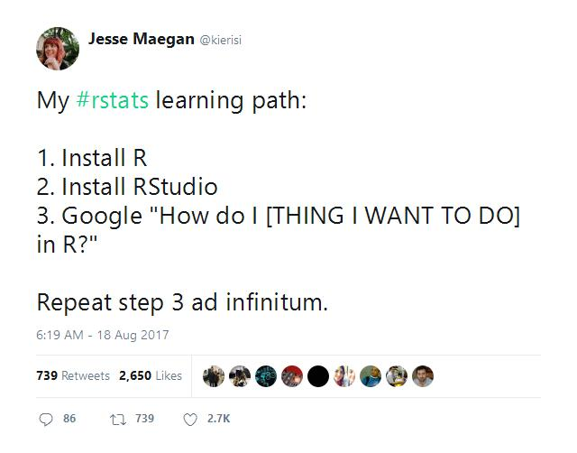
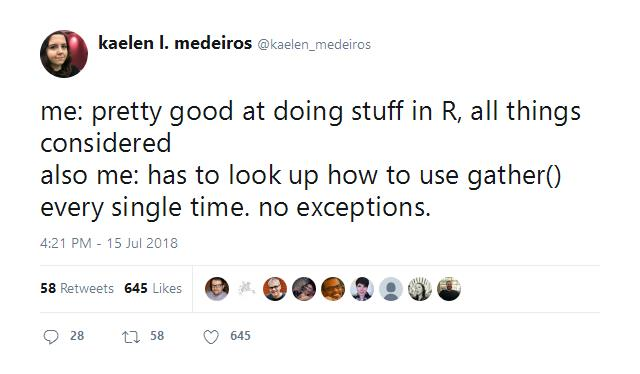
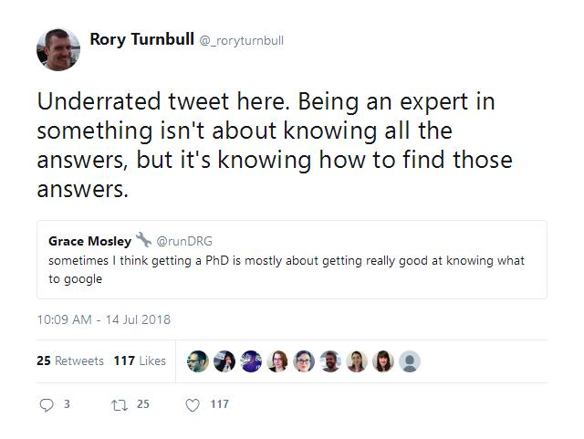
]

.footer.muted[
https://twitter.com/kierisi/status/898534740051062785  
https://twitter.com/kaelen_medeiros/status/1018636793221189632  
https://twitter.com/_roryturnbull/status/1018180596965621760
]

---
## Community Leaders

.card[
.card-img[]

## Hadley Wickham

### [hadley.nz](http://hadley.nz/)

Chief Scientist at RStudio, I build tools (computational and cognitive) that make data science easier, faster, and more fun.
]

.card[
.card-img[]

## Jenny<br>Bryan

### [github.com/jennybc](https://github.com/jennybc)

Software engineer @rstudio, humane #rstats, adjunct prof @UBC where I created @STAT545, part of @ropensci
]

.card[
.card-img[]

## Julia<br>Silge

### [juliasilge.com](https://juliasilge.com)

Data science and visualization at @StackOverflow, #rstats, author of Tidy Text Mining with R
]

.card[
.card-img[]

## David Robinson

### [varianceexplained.org](https://varianceexplained.org)

Chief Data Scientist at @DataCamp, #rstats fan/evangelist
]

---

## Online Community

.card[
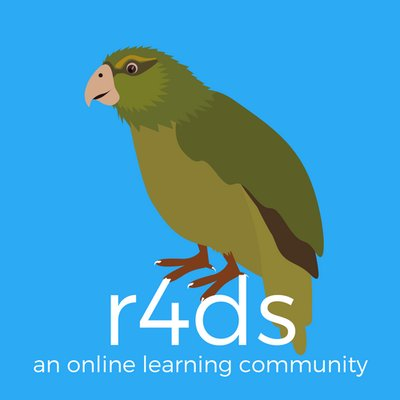

### [@R4DScommunity](https://twitter.com/R4DScommunity)

Online community working through [R for Data Science](http://r4ds.had.co.nz/)
]

.right-column.center[
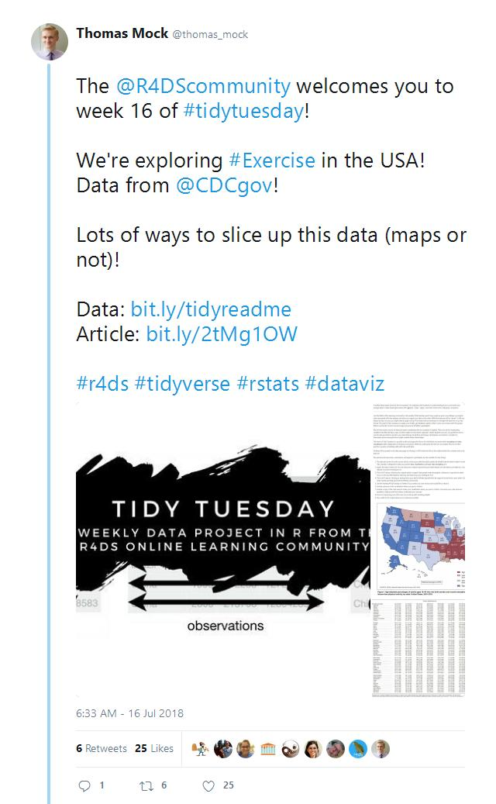
]

---
# Before we get started...

.big[
- &#x1F64B;&#x1F3FB;&#x200D;&#x2640; Installed **R**

- &#x1F64B;&#x1F3FD;&#x200D;&#x2642;&#xFE0F; Installed **RStudio**

- &#x1F44F;&#x1F3FD; Installed .pkg[tidyverse]
]
