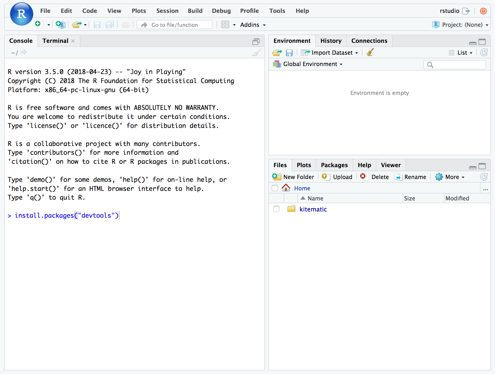
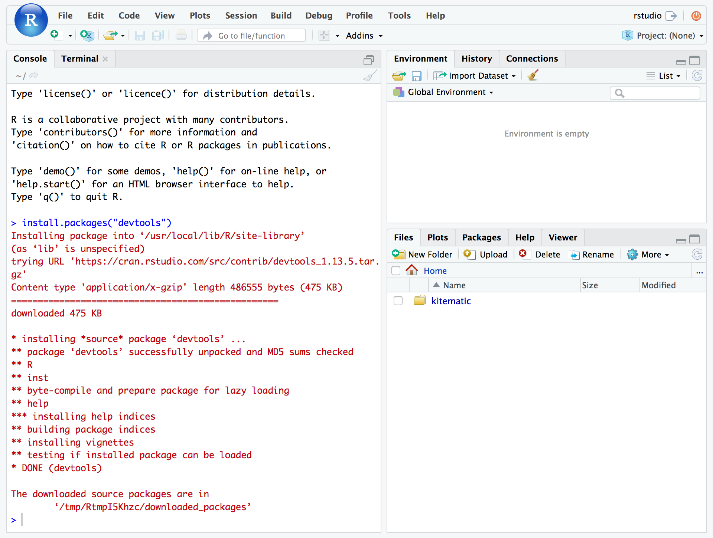

System Requirements
================

## R

The [R programming language](https://www.r-project.org/) can be
downloaded at <https://cran.rstudio.com/>. The current available version
of R is 3.5.0, but you don't need to upgrade if you already have version 
3.4 or later installed.

Jump directly to the download page for each platform:

  - [R for Windows](https://cran.rstudio.com/bin/windows/base/)
  - [R for MacOS](https://cran.rstudio.com/bin/macosx/)
  - [R for Unix](https://cran.rstudio.com/bin/linux/)

For an interactive guide, the following videos by Roger Peng of Johns
Hopkins Biostatistics are slightly outdated but cover the essential
process.

  - [Installing R on Windows](https://youtu.be/watch?v=mfGFv-iB724)
  - [Installing R on Mac](http://youtu.be/Icawuhf0Yqo)

## RStudio

RStudio is an *integrated development environment* (IDE) for R that
makes it much easier to use R. It includes a code editor, debugging and
visualization tool, a file manager, and much more.

Download and install RStudio from the [RStudio download
page](https://www.rstudio.com/products/rstudio/download/#download).

The current version of RStudio is 1.1.453 and any version greater than
1.1.0 will work. (Version 1.0+ will also work if already installed.)

## Installing Packages

The R language is extended via user-created *packages*. You will need to
be able to download and install packages for the course.

To test if you can install an R package, open RStudio, type the
following into the **Console** pane and hit enter to run.

``` r
install.packages("devtools")
```



R will output messages while it works to install the package.



If you have any issues, copy the output and email to
<Garrick.AdenBuie@moffitt.org> or <Travis.Gerke@moffitt.org>.

## Access to GitHub

We will also use GitHub to host course materials and to dicuss issues
that come up during the course, so please make sure that you can browse
to <https://github.com/gerkelab/core-r-course>.
